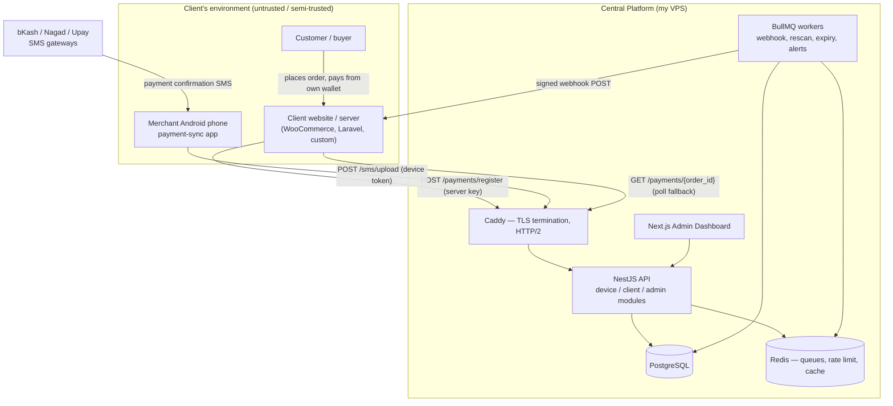
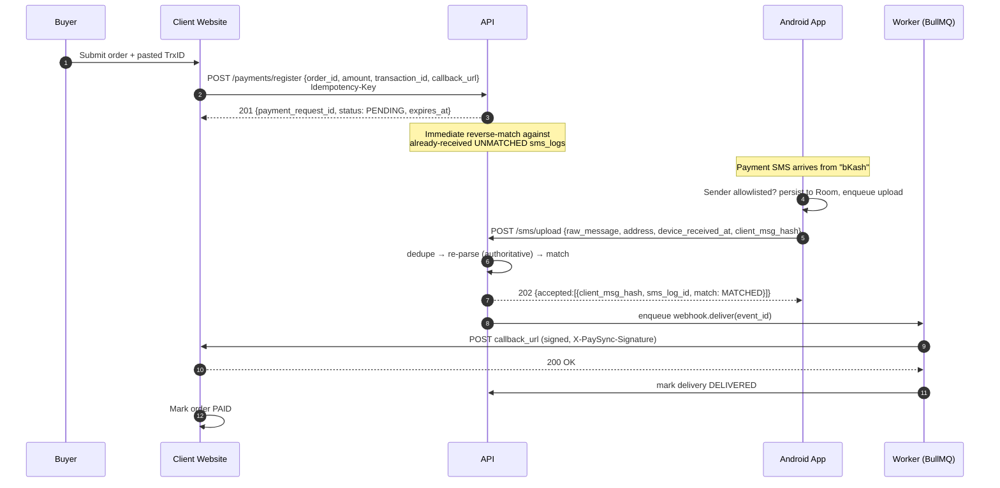
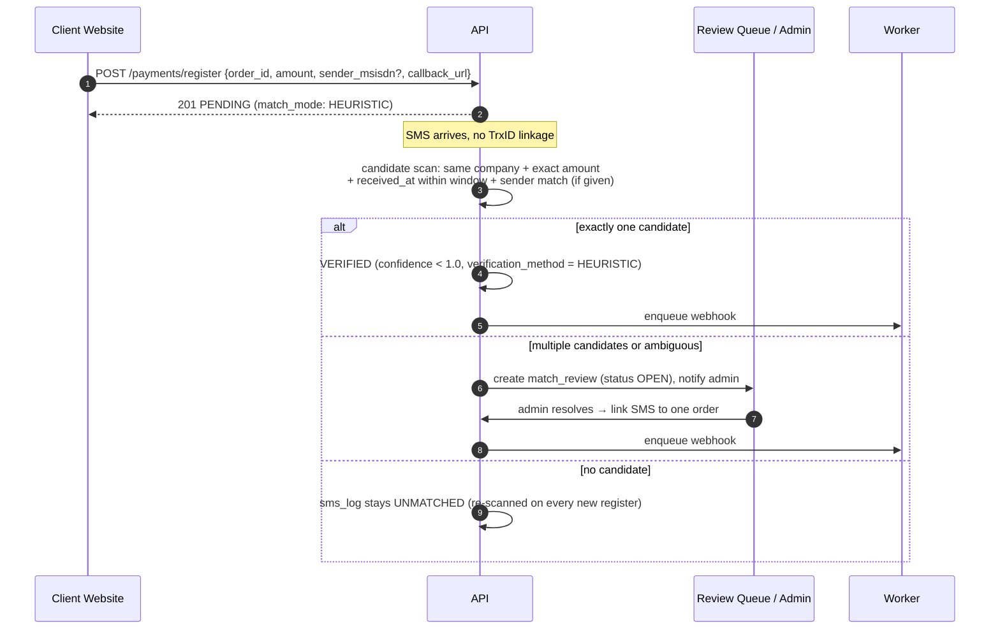
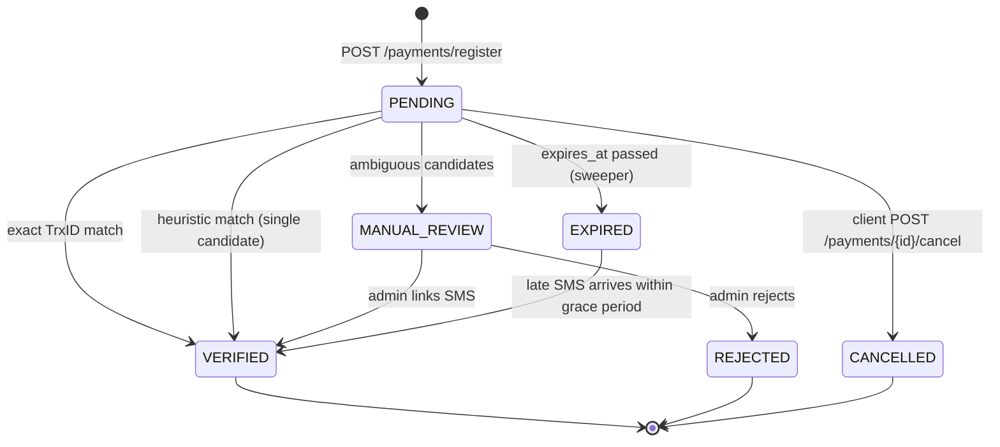
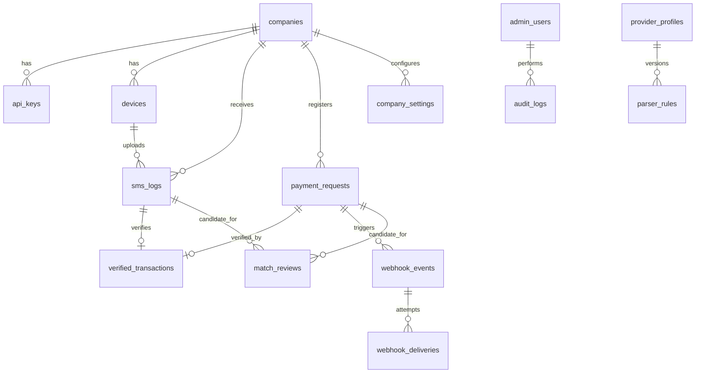

# Payment Verification Platform — System Architecture

**Project:** payment-sync
**Version:** 1.0 (initial architecture)
**Date:** 2026-07-27
**Owner:** single administrator (platform is not multi-admin, not self-service)
**Source requirements:** [`plan.md`](./plan.md)

---

## Table of Contents

1. [Scope & Objectives](#1-scope--objectives)
2. [Architectural Decisions](#2-architectural-decisions-adr-summary)
3. [System Context](#3-system-context)
4. [Repository Structure](#4-repository-structure)
5. [End-to-End Flows](#5-end-to-end-flows)
6. [Data Model](#6-data-model)
7. [API Surface](#7-api-surface)
8. [SMS Parsing Subsystem](#8-sms-parsing-subsystem)
9. [Matching Engine](#9-matching-engine)
10. [Webhook Delivery Subsystem](#10-webhook-delivery-subsystem)
11. [Android Application Architecture](#11-android-application-architecture)
12. [Admin Dashboard Architecture](#12-admin-dashboard-architecture)
13. [Security Architecture & Threat Model](#13-security-architecture--threat-model)
14. [Reliability & Correctness Guarantees](#14-reliability--correctness-guarantees)
15. [Observability & Operations](#15-observability--operations)
16. [Deployment & Infrastructure](#16-deployment--infrastructure)
17. [Privacy, Legal & Store Distribution](#17-privacy-legal--store-distribution)
18. [Testing Strategy](#18-testing-strategy)
19. [Delivery Roadmap](#19-delivery-roadmap)
20. [Open Questions](#20-open-questions)

---

## 1. Scope & Objectives

### 1.1 What this system does

Verifies that a customer's mobile-money payment (bKash / Nagad / Upay) actually arrived in a
merchant's personal or agent wallet, **without** any official merchant API, by reading the
payment-confirmation SMS on the merchant's own Android phone and matching it against orders the
merchant's website registered as pending.

### 1.2 Actors

| Actor | Description | Trust level |
|---|---|---|
| **Admin** (me) | Sole operator. Onboards companies, issues credentials, monitors, resolves reviews. | Fully trusted |
| **Company / Client** | A business that licenses the Android app. Has 1..n phones and 1 website. | Semi-trusted tenant |
| **Merchant phone (device)** | Android app instance running on the client's phone. | **Untrusted** — physically outside my control, app is decompilable |
| **Client website (server)** | Registers orders, receives webhooks. Server-to-server. | Semi-trusted tenant |
| **Customer** | End buyer. Never talks to this platform directly. | Untrusted |

### 1.3 Non-goals (v1)

- No public sign-up, no self-service billing, no merchant-facing dashboard (see roadmap).
- Not an escrow, not a payment processor — the platform **never moves money**; it only asserts
  "an SMS consistent with this payment was received on the registered device".
- No official provider API integration, no scraping of provider apps/portals.

### 1.4 Hard constraints that shaped this design

1. **The device is untrusted.** SMS content is user-forgeable on a rooted phone, and any secret
   shipped inside the APK is public. Therefore: the app never holds a credential that can register
   or verify orders, and every SMS is re-parsed and re-validated server-side.
2. **The device is unreliable.** Android OEM battery killers, doze mode, force-close, no network,
   airplane mode, phone off. The system must be *eventually consistent*, never "SMS lost = order
   lost". This is why the device keeps a durable local queue and a reconciliation scan.
3. **Delivery is at-least-once, everywhere.** SMS may be uploaded twice, webhooks may be delivered
   twice. Every mutating boundary is idempotent.
4. **Money must never be double-credited.** One SMS may verify at most one order; one order may be
   verified by at most one SMS. Enforced by DB constraints, not just application logic.

---

## 2. Architectural Decisions (ADR summary)

| # | Decision | Rationale | Rejected alternative |
|---|---|---|---|
| 1 | **Monorepo** (pnpm workspaces) containing api, admin, android, shared packages | One place for the API contract, HMAC implementation, and SMS-parser fixtures; atomic cross-cutting changes | Separate repos — contract drift between server and app is the #1 integration risk here |
| 2 | **NestJS + Prisma + PostgreSQL** | Modules/DI map cleanly onto the subsystems below; Prisma gives typed queries + reviewable SQL migrations | Express (less structure for queues/validation as it grows); TypeORM (weaker migration ergonomics) |
| 3 | **Redis + BullMQ** for webhooks, matching re-scans, expiry sweeps | Retries with exponential backoff, DLQ, delayed jobs, and rate limiting are first-class | In-process `setTimeout` retries (lost on restart); DB-polling queue (works, but reinvents BullMQ) |
| 4 | **Two distinct credential types per company**: `device` key and `server` key | The APK is decompilable. A leaked device key must NOT be able to register orders or read order data | Single `api_key` for both (as in plan.md) — a decompiled app key would let an attacker create and self-verify orders |
| 5 | **Server-side re-parse is authoritative**; the device's parse is a hint only | Prevents a tampered app from asserting a fake amount/TrxID; lets me fix parser bugs and add providers **without an app release** | Trusting device-side parse |
| 6 | **Hybrid matching**: exact `transaction_id` first, then amount+window+sender fallback with a manual-review queue | Real BD checkout flows sometimes can't collect a TrxID; deterministic path stays deterministic | TrxID-only (fails real flows); amount-only (collisions → false positives on money) |
| 7 | **Amounts stored as `NUMERIC(14,2)`, compared as integer paisa, transported as decimal strings** | Never do float math on money; `1250.00` vs `1250` vs `1,250.00` must compare equal | JS `number` end-to-end |
| 8 | **All timestamps stored UTC (`timestamptz`); presentation in `Asia/Dhaka` (UTC+06)** | Device clocks are skewed and untrusted; provider SMS times are local | Local-time storage |
| 9 | **Webhook signature = HMAC-SHA256 over `timestamp.body`, with `event_id`** | Plain body HMAC is replayable; timestamp + event id gives replay protection and client-side idempotency | Bare `HMAC(body)` |
| 10 | **Single VPS + Docker Compose + Caddy** | Cost, control, and sufficient headroom for the expected scale; every component is a container so a PaaS/AWS move is a compose→manifest translation, not a rewrite | Managed PaaS (cost), AWS ECS (complexity for a one-operator product) |
| 11 | **Client integration = documented REST + OpenAPI + copy-paste signature snippets** (no SDK/plugin in v1) | Chosen scope; keeps the deliverable surface small | Shipping a WooCommerce plugin now (deferred to roadmap) |
| 12 | **Multi-device modelled from day one** (`devices` table), even though "multiple phones" is a v2 feature | Retrofitting device identity into `sms_logs` later is a painful migration; cost now is one table | Company-only attribution |
| 13 | **Order status is also pollable** (`GET /payments/{order_id}`) | Webhooks fail (client downtime, firewall, bad TLS). A poll fallback prevents "paid but order stuck" support tickets | Webhook-only delivery |
| 14 | **A mistyped `transaction_id` on an exact-mode order is correctable** via `PATCH /payments/{order_id}/transaction-id`, but **only while PENDING or EXPIRED-within-grace** (never after VERIFIED); the correction re-runs matching immediately and is audited | The buyer typed the TrxID; a fat-finger must be fixable without abandoning the order, but a correction after verification could steal a second payment or rewrite history | Cancel-and-re-register (loses the order's history and any already-arrived SMS association); allowing edits anytime (a post-VERIFIED edit is an attack surface on money) |

---

## 3. System Context



### 3.1 Trust boundaries

```
┌──────────────────────────── Boundary A: device ────────────────────────────┐
│ Android app. Holds a device token (revocable, per-device, scoped to        │
│ sms:upload + device:heartbeat + config:read). Cannot read orders, cannot   │
│ register orders, cannot verify anything.                                   │
└────────────────────────────────────────────────────────────────────────────┘
┌──────────────────────────── Boundary B: client server ─────────────────────┐
│ Holds a server key (secret, never in browser/app). Can register/cancel/    │
│ read its own orders. Scoped to one company_id. Cannot see other tenants,   │
│ cannot see raw SMS bodies, cannot force-verify.                            │
└────────────────────────────────────────────────────────────────────────────┘
┌──────────────────────────── Boundary C: admin ─────────────────────────────┐
│ Email+password+TOTP, short-lived JWT, optional IP allowlist. Full access,  │
│ every mutation written to audit_logs.                                      │
└────────────────────────────────────────────────────────────────────────────┘
```

**Key rule:** verification is only ever decided by the server, from a raw SMS body that the server
itself parsed, against an order the client's *server* registered. No single compromised party can
mint a verified payment.

---

## 4. Repository Structure

```text
payment-sync/
├─ apps/
│  ├─ api/                        # NestJS — HTTP API + queue producers
│  │  ├─ src/
│  │  │  ├─ main.ts
│  │  │  ├─ app.module.ts
│  │  │  ├─ common/               # guards, interceptors, filters, pipes
│  │  │  │  ├─ auth/              # DeviceTokenGuard, ServerKeyGuard, AdminJwtGuard
│  │  │  │  ├─ idempotency/       # IdempotencyInterceptor + store
│  │  │  │  ├─ ratelimit/         # Redis sliding-window guard
│  │  │  │  └─ errors/            # error envelope, codes, exception filter
│  │  │  ├─ modules/
│  │  │  │  ├─ companies/         # tenant CRUD, key issuance & rotation
│  │  │  │  ├─ devices/           # enrollment, heartbeat, config, revocation
│  │  │  │  ├─ sms/               # upload (single + batch), dedupe, re-parse
│  │  │  │  ├─ payments/          # register, cancel, status poll, expiry
│  │  │  │  ├─ matching/          # the matching engine (pure core + tx runner)
│  │  │  │  ├─ webhooks/          # signing, delivery producer, retry, replay
│  │  │  │  ├─ reviews/           # ambiguous-match queue + resolution
│  │  │  │  ├─ analytics/         # dashboard aggregates
│  │  │  │  ├─ admin/             # admin auth (TOTP), audit log, ops actions
│  │  │  │  └─ health/            # /healthz, /readyz, /metrics
│  │  │  └─ workers/              # BullMQ processors (run as separate process)
│  │  │     ├─ webhook-delivery.processor.ts
│  │  │     ├─ rescan-unmatched.processor.ts
│  │  │     ├─ expire-orders.processor.ts
│  │  │     └─ device-health.processor.ts
│  │  ├─ prisma/
│  │  │  ├─ schema.prisma
│  │  │  ├─ migrations/
│  │  │  └─ seed.ts               # admin user, provider profiles, parser rules
│  │  └─ test/                    # e2e (supertest + testcontainers)
│  │
│  ├─ admin/                      # Next.js 15 (App Router) admin dashboard
│  │  ├─ app/(auth)/login
│  │  ├─ app/(dash)/companies
│  │  ├─ app/(dash)/transactions  # sms logs | pending | verified | failed
│  │  ├─ app/(dash)/reviews       # ambiguous match resolution
│  │  ├─ app/(dash)/webhooks      # deliveries, retry, DLQ
│  │  ├─ app/(dash)/devices       # online/offline, last heartbeat
│  │  ├─ app/(dash)/analytics
│  │  └─ lib/api-client.ts        # generated from openapi.yaml
│  │
│  └─ android/                    # Kotlin + Jetpack Compose
│     └─ app/src/main/kotlin/com/inovisolutions/paymentsync/
│        ├─ ui/                   # Compose screens + ViewModels
│        ├─ domain/               # use cases, models, sync state machine
│        ├─ data/
│        │  ├─ local/             # Room DAOs, entities, migrations
│        │  ├─ remote/            # Retrofit services, DTOs, interceptors
│        │  ├─ secure/            # EncryptedSharedPreferences credential store
│        │  └─ sms/               # SmsReceiver, InboxScanner, parser engine
│        ├─ work/                 # WorkManager workers
│        └─ di/                   # Hilt modules
│
├─ packages/
│  ├─ shared/                     # TS: DTO types, enums, error codes, HMAC signing
│  ├─ parsers/                    # Provider parser rules (JSON) + reference impl + fixtures
│  │  ├─ rules/bkash.json  nagad.json  upay.json
│  │  └─ fixtures/                # real anonymised SMS bodies → expected extraction
│  └─ config/                     # shared eslint/tsconfig/prettier
│
├─ infra/
│  ├─ docker-compose.yml          # prod: caddy, api, worker, admin, postgres, redis
│  ├─ docker-compose.dev.yml      # local: postgres + redis only
│  ├─ Caddyfile
│  ├─ backup/pg_backup.sh         # nightly pg_dump → S3/R2, restore-tested
│  └─ .env.example
│
├─ docs/
│  ├─ openapi.yaml                # single source of truth for the public contract
│  ├─ integration-guide.md        # client-facing: register → webhook → verify
│  ├─ webhook-verification/       # PHP / Node / Python / Laravel snippets
│  ├─ android-setup-guide.md      # client-facing install + permission walkthrough
│  ├─ runbook.md                  # ops: incidents, restore, key rotation
│  └─ privacy-policy.md
│
├─ architecture.md                # this document
└─ plan.md                        # product requirements
```

**Why the parser rules live in `packages/parsers` as JSON:** they are served to devices via
`GET /device/config` and used by the server's authoritative parser. One source, two consumers, and
adding a provider or fixing a regex is a data change, not an app release. Fixtures are the
regression suite.

---

## 5. End-to-End Flows

### 5.1 Happy path — TrxID known at checkout



### 5.2 Fallback path — no TrxID collected



### 5.3 Manual Sync / recovery path

Triggered by the app's **Manual Sync** button, and automatically by `ReconcileWorker` every 6 h.

```
1. App scans the SMS inbox (ContentResolver) for the last N days,
   filtered to allowlisted provider addresses.
2. For each message it computes client_msg_hash = SHA256(company_id|address|body|sms_timestamp).
3. Local diff: which hashes have no server_id / are in FAILED or PENDING sync state?
4. Upload in batches of ≤50 → POST /sms/upload (source = MANUAL_SYNC).
5. Server dedupes by (company_id, client_msg_hash) — already-known messages return
   {status: DUPLICATE, sms_log_id} so the app can heal its local state.
6. Server then re-runs the matching engine over ALL still-UNMATCHED sms_logs for that
   company (rescan-unmatched job), not just the newly uploaded ones.
7. Any match produces a webhook immediately.
8. Response includes a per-message result so the UI can show "12 scanned, 3 new, 1 matched".
```

This one path covers every failure mode listed in `plan.md §9`: outages, force-close, OEM battery
kills, missed broadcasts.

### 5.4 Order lifecycle



`EXPIRED → VERIFIED` is deliberate: a merchant's phone can be offline for hours. Within
`late_match_grace_hours` (default 24 h) a late SMS still verifies and still fires the webhook, with
`was_late: true` in the payload so the client can decide how to handle it.

---

## 6. Data Model

PostgreSQL 16. All PKs are `uuid` (v7 preferred for index locality). All money is
`NUMERIC(14,2)`. All timestamps are `timestamptz` stored in UTC.



### 6.1 `companies`

| Column | Type | Notes |
|---|---|---|
| `id` | uuid PK | |
| `company_code` | varchar(32) UNIQUE | human-facing, e.g. `COMP12345` (`company_id` in plan.md) |
| `name` | varchar(160) | |
| `contact_email`, `contact_phone` | varchar | for outage alerts |
| `status` | enum `ACTIVE\|SUSPENDED\|DISABLED` | non-ACTIVE ⇒ all tenant endpoints 403 |
| `webhook_secret_enc` | bytea | AES-256-GCM encrypted (must be *retrievable* to sign, so encrypted, not hashed) |
| `webhook_secret_prev_enc` | bytea NULL | supports zero-downtime secret rotation (dual-sign window) |
| `webhook_secret_rotated_at` | timestamptz NULL | |
| `default_callback_url` | text NULL | used when register omits one |
| `notes` | text | admin-only |
| `created_at`, `updated_at`, `disabled_at` | timestamptz | |

### 6.2 `api_keys`

Separates the two credential types (ADR-4). Keys are shown **once** at creation.

| Column | Type | Notes |
|---|---|---|
| `id` | uuid PK | |
| `company_id` | uuid FK | |
| `key_type` | enum `SERVER\|DEVICE_ENROLL` | |
| `prefix` | varchar(16) | `psk_live_` / `pde_live_` + 6 chars, indexed for O(1) lookup |
| `key_hash` | varchar(97) | Argon2id of the full key (never bcrypt-truncated) |
| `label` | varchar(80) | e.g. "main website", "shop phone enrolment" |
| `scopes` | text[] | `payments:write`, `payments:read`, `device:enroll` |
| `last_used_at`, `last_used_ip` | | |
| `expires_at` | timestamptz NULL | |
| `revoked_at` | timestamptz NULL | rotation = create new + revoke old after a grace period |

Indexes: `(prefix)`, `(company_id, key_type) WHERE revoked_at IS NULL`.

### 6.3 `devices`

| Column | Type | Notes |
|---|---|---|
| `id` | uuid PK | |
| `company_id` | uuid FK | |
| `device_name` | varchar(80) | admin/merchant label, e.g. "Shop Counter Phone" |
| `install_id` | uuid UNIQUE | app-generated, survives updates, dies on reinstall |
| `model`, `manufacturer`, `android_version`, `app_version` | varchar | diagnostics |
| `wallet_msisdn` | varchar(20) NULL | the merchant number this phone receives payments on |
| `token_hash` | varchar(97) | Argon2id of the long-lived device token |
| `token_issued_at`, `token_rotated_at` | timestamptz | |
| `status` | enum `ACTIVE\|BLOCKED\|RETIRED` | |
| `last_heartbeat_at` | timestamptz | drives the offline alert |
| `last_sms_at` | timestamptz | drives "phone alive but capturing nothing" alert |
| `battery_pct`, `is_ignoring_battery_opt`, `has_sms_permission`, `network_type` | | health telemetry from heartbeat |
| `clock_skew_seconds` | int | `server_now − device_now`, used to normalise device timestamps |

### 6.4 `sms_logs`

The immutable record of every captured message. Retained per policy (§17.3).

| Column | Type | Notes |
|---|---|---|
| `id` | uuid PK | |
| `company_id` | uuid FK | |
| `device_id` | uuid FK NULL | |
| `client_msg_hash` | char(64) | SHA-256 computed on device; **UNIQUE (company_id, client_msg_hash)** ⇒ upload idempotency |
| `content_hash` | char(64) | SHA-256 of normalised body, server-computed; catches re-uploads after reinstall |
| `sms_address` | varchar(32) | originating address (`bKash`, `NAGAD`, `upay`) — **required**, this is the anti-spoof signal |
| `provider` | enum `BKASH\|NAGAD\|UPAY\|UNKNOWN` | resolved server-side from `sms_address` + body |
| `raw_message` | text | verbatim body, needed for re-parse and dispute evidence |
| `transaction_id` | varchar(64) NULL | server-extracted, normalised uppercase |
| `amount` | numeric(14,2) NULL | server-extracted |
| `sender_msisdn` | varchar(20) NULL | normalised to `+8801XXXXXXXXX` |
| `balance_after` | numeric(14,2) NULL | useful for reconciliation/fraud checks |
| `fee` | numeric(14,2) NULL | |
| `sms_timestamp` | timestamptz NULL | parsed from the message body (provider's own time) |
| `device_received_at` | timestamptz | phone clock, skew-corrected |
| `uploaded_at` | timestamptz | server receipt time — the only fully trusted clock |
| `parse_status` | enum `PARSED\|PARTIAL\|UNPARSED\|IGNORED` | `UNPARSED` feeds the parser-improvement queue |
| `parser_rule_version` | int NULL | which rule version produced this extraction |
| `parse_confidence` | numeric(3,2) | |
| `match_status` | enum `UNMATCHED\|MATCHED\|IN_REVIEW\|IGNORED\|DUPLICATE_TXN` | |
| `upload_source` | enum `REALTIME\|MANUAL_SYNC\|RECONCILE` | |
| `flags` | text[] | `SUSPICIOUS_ADDRESS`, `FUTURE_TIMESTAMP`, `AMOUNT_MISMATCH`, `DUPLICATE_TXN_ID` |

Indexes:
```sql
CREATE UNIQUE INDEX ON sms_logs (company_id, client_msg_hash);
CREATE INDEX ON sms_logs (company_id, transaction_id) WHERE transaction_id IS NOT NULL;
CREATE INDEX ON sms_logs (company_id, match_status, sms_timestamp DESC);
CREATE INDEX ON sms_logs (company_id, amount, sms_timestamp);  -- heuristic candidate scan
CREATE INDEX ON sms_logs (parse_status) WHERE parse_status IN ('UNPARSED','PARTIAL');
```

### 6.5 `payment_requests`

(`pending_transactions` in plan.md — renamed because the row outlives the "pending" state.)

| Column | Type | Notes |
|---|---|---|
| `id` | uuid PK | |
| `company_id` | uuid FK | |
| `order_id` | varchar(80) | **UNIQUE (company_id, order_id)** ⇒ register idempotency |
| `transaction_id` | varchar(64) NULL | normalised; NULL ⇒ heuristic mode |
| `expected_amount` | numeric(14,2) | |
| `expected_provider` | enum NULL | narrows the search when the customer picked a wallet |
| `expected_sender_msisdn` | varchar(20) NULL | strong heuristic signal |
| `callback_url` | text | must be `https://`, public host, validated at register (SSRF guard) |
| `status` | enum `PENDING\|VERIFIED\|MANUAL_REVIEW\|EXPIRED\|CANCELLED\|REJECTED` | |
| `match_mode` | enum `EXACT\|HEURISTIC` | derived from whether a TrxID was supplied |
| `amount_tolerance` | numeric(14,2) | copied from settings at register time (immutable per order) |
| `metadata` | jsonb | opaque client passthrough, echoed in the webhook (≤4 KB) |
| `expires_at` | timestamptz | `created_at + settings.order_ttl_minutes` |
| `verified_at` | timestamptz NULL | |
| `created_at`, `updated_at` | | |

Indexes:
```sql
CREATE UNIQUE INDEX ON payment_requests (company_id, order_id);
CREATE UNIQUE INDEX ON payment_requests (company_id, transaction_id)
  WHERE transaction_id IS NOT NULL AND status IN ('PENDING','VERIFIED');
CREATE INDEX ON payment_requests (company_id, status, expires_at);
CREATE INDEX ON payment_requests (company_id, expected_amount, created_at)
  WHERE status = 'PENDING';
```
The second index is a real business rule: **two live orders cannot claim the same TrxID.**

### 6.6 `verified_transactions`

The money-critical join. Both FKs are UNIQUE — this is where double-crediting is made impossible.

| Column | Type | Notes |
|---|---|---|
| `id` | uuid PK | |
| `company_id` | uuid FK | |
| `payment_request_id` | uuid FK **UNIQUE** | one order verified once |
| `sms_log_id` | uuid FK **UNIQUE** | one SMS spends once |
| `verification_method` | enum `EXACT_TXN_ID\|HEURISTIC_AMOUNT_WINDOW\|MANUAL_ADMIN` | |
| `confidence` | numeric(3,2) | `1.00` for exact |
| `amount_delta` | numeric(14,2) | expected − received; non-zero is legal but visible |
| `matched_by_admin_id` | uuid NULL | set for `MANUAL_ADMIN` |
| `was_late` | boolean | matched after `expires_at` |
| `verified_at` | timestamptz | |

### 6.7 `webhook_events` / `webhook_deliveries`

Event and attempt are separate so retries never mutate the payload that was signed.

**`webhook_events`**: `id` (= `event_id` sent to the client), `company_id`, `payment_request_id`,
`event_type` (`payment.verified` | `payment.expired` | `payment.review_required` | `test.ping`),
`payload` jsonb (frozen at creation), `status` (`PENDING|DELIVERED|FAILED|DEAD|CANCELLED`),
`attempt_count`, `next_attempt_at`, `delivered_at`, `created_at`.

**`webhook_deliveries`** (one row per attempt): `id`, `event_id` FK, `attempt_no`,
`request_url`, `request_headers` jsonb (secret redacted), `response_status`, `response_body`
(truncated 2 KB), `error_class` (`DNS|TLS|TIMEOUT|CONN_REFUSED|HTTP_4XX|HTTP_5XX|BAD_BODY`),
`duration_ms`, `attempted_at`.

Index: `webhook_events (status, next_attempt_at)` for the retry sweeper;
`webhook_events (company_id, created_at DESC)` for the dashboard.

### 6.8 `match_reviews`

| Column | Type | Notes |
|---|---|---|
| `id` | uuid PK | |
| `company_id` | uuid FK | |
| `sms_log_id` | uuid FK NULL | set when an SMS has ≥2 candidate orders |
| `payment_request_id` | uuid FK NULL | set when an order has ≥2 candidate SMS |
| `reason` | enum `AMBIGUOUS_CANDIDATES\|AMOUNT_MISMATCH\|DUPLICATE_TXN_ID\|SUSPICIOUS_SMS\|UNPARSED_MESSAGE` | |
| `candidates` | jsonb | ranked `[{id, score, why}]` snapshot at detection time |
| `status` | enum `OPEN\|RESOLVED\|DISMISSED` | |
| `resolved_by`, `resolution_note`, `resolved_at` | | |

### 6.8b `match_attempts` (decision trace)

Every matching decision — including non-decisions — is recorded so the dashboard can answer
"why wasn't this verified?" on one screen (§12). Without this, that question requires reading logs.

| Column | Type | Notes |
|---|---|---|
| `id` | uuid PK | |
| `company_id` | uuid FK | |
| `trigger` | enum `SMS_UPLOAD\|ORDER_REGISTER\|RESCAN\|REPARSE\|ADMIN` | |
| `sms_log_id` | uuid FK NULL | |
| `payment_request_id` | uuid FK NULL | the chosen order, if any |
| `result` | enum `VERIFIED\|UNMATCHED\|REVIEW\|IGNORED\|DUPLICATE\|GUARD_REJECTED` | |
| `pass` | enum `EXACT\|HEURISTIC\|NONE` | |
| `guard_failed` | varchar(64) NULL | e.g. `DIRECTION_NOT_CREDIT`, `PROVIDER_NOT_ALLOWED` |
| `candidates` | jsonb | ranked `[{payment_request_id, score, signals, why}]` snapshot |
| `chosen_score`, `runner_up_score` | numeric(3,2) NULL | drives the 0.25-gap rule in §9.3 |
| `parser_rule_version` | int NULL | |
| `duration_ms` | int | |
| `created_at` | timestamptz | |

Indexes: `(sms_log_id, created_at DESC)`, `(payment_request_id, created_at DESC)`,
`(company_id, result, created_at DESC)`. Retention 90 days.

### 6.9 `company_settings`

Per-tenant matching/verification policy — the knobs that stop me from redeploying to tune behaviour.

| Column | Default | Purpose |
|---|---|---|
| `order_ttl_minutes` | 60 | when PENDING → EXPIRED |
| `late_match_grace_hours` | 24 | how long an EXPIRED order can still be rescued |
| `heuristic_window_minutes` | 30 | `\|sms_time − order_time\|` bound for fallback matching |
| `heuristic_enabled` | true | tenant can force exact-only |
| `amount_tolerance` | 0.00 | absolute BDT tolerance |
| `require_sender_match` | false | if true, heuristic requires MSISDN match |
| `auto_verify_min_confidence` | 0.90 | below ⇒ manual review instead of auto-verify |
| `allowed_providers` | `{BKASH,NAGAD,UPAY}` | |
| `webhook_timeout_ms` | 8000 | |
| `webhook_max_attempts` | 8 | |
| `rate_limit_register_rpm` | 120 | |
| `sms_retention_days` | 180 | |

### 6.10 `provider_profiles` / `parser_rules`

**`provider_profiles`**: `provider`, `display_name`, `sender_addresses` text[] (the allowlist pushed
to devices), `msisdn_prefixes`, `is_active`.

**`parser_rules`**: `id`, `provider`, `version` int, `rule` jsonb (see §8.2), `is_active`,
`created_at`, `created_by`, `fixture_pass_count`. Versioned and append-only: every `sms_log` records
the `parser_rule_version` used, so a re-parse after a rule fix is auditable and reversible.

### 6.11 Supporting tables

- **`admin_users`**: `email` UNIQUE, `password_hash` (Argon2id), `totp_secret_enc`, `totp_enrolled_at`,
  `recovery_codes_hash` text[], `failed_login_count`, `locked_until`, `last_login_at/ip`.
- **`admin_sessions`**: refresh-token family with `revoked_at` + `replaced_by` (rotation + reuse detection).
- **`audit_logs`**: `actor_type` (`ADMIN|SYSTEM|CLIENT|DEVICE`), `actor_id`, `action`,
  `entity_type`, `entity_id`, `before`/`after` jsonb, `ip`, `user_agent`, `created_at`.
  Written for every company/key/device mutation, manual verify, webhook replay, and settings change.
- **`auth_attempts`**: every credential presentation (admin login, server key, device token) with
  outcome + IP — satisfies "log all authentication attempts", and feeds brute-force lockout.
- **`idempotency_keys`**: `(company_id, endpoint, key)` UNIQUE, `request_hash`, `response_status`,
  `response_body` jsonb, `state` (`IN_FLIGHT|COMPLETED`), `expires_at` (24 h). Same key + different
  body ⇒ `409 IDEMPOTENCY_KEY_REUSED`.
- **`outbox_events`** *(optional, phase 2)*: transactional outbox if webhook enqueue must be
  atomic with the verifying transaction rather than post-commit.

---

## 7. API Surface

Base: `https://api.<domain>/api/v1`. JSON only. `docs/openapi.yaml` is the contract of record; the
admin client and integration docs are generated from it.

### 7.1 Conventions

**Auth by audience**

| Audience | Header | Credential |
|---|---|---|
| Device | `Authorization: Bearer <device_token>` + `X-Install-Id` | per-device token from enrollment |
| Client server | `Authorization: Bearer psk_live_...` + `X-Company-Id` | server key (never in a browser/app) |
| Admin | `Authorization: Bearer <jwt>` | 15-min access JWT + rotating refresh cookie |

**Error envelope** (every non-2xx):

```json
{
  "error": {
    "code": "AMOUNT_MISMATCH",
    "message": "Received amount differs from expected beyond tolerance.",
    "details": { "expected": "1250.00", "received": "1200.00" },
    "request_id": "01J8Z9K7Q4R2..."
  }
}
```

Stable codes: `UNAUTHENTICATED`, `INVALID_CREDENTIAL`, `COMPANY_SUSPENDED`, `DEVICE_BLOCKED`,
`FORBIDDEN_SCOPE`, `VALIDATION_ERROR`, `DUPLICATE_ORDER_ID`, `DUPLICATE_TRANSACTION_ID`,
`IDEMPOTENCY_KEY_REUSED`, `ORDER_NOT_FOUND`, `ORDER_NOT_PENDING`, `INVALID_CALLBACK_URL`,
`RATE_LIMITED`, `PAYLOAD_TOO_LARGE`, `INTERNAL_ERROR`.

**Idempotency**: `POST /payments/register` and `POST /sms/upload` accept `Idempotency-Key`.
`register` additionally treats `(company_id, order_id)` as a natural idempotency key and returns
the existing resource with `200` instead of `409` when the body matches.

**Rate limits** (Redis sliding window, per company and per device; `429` + `Retry-After`):
`sms/upload` 120 req/min/device (batch ≤ 50 messages), `payments/register` 120 req/min/company
(configurable), `device/register` 5 req/hour/company, admin login 10 req/hour/IP.

**Pagination**: cursor-based (`?cursor=&limit=`, max 100) on all admin list endpoints.

### 7.2 Device API

| Method | Path | Purpose |
|---|---|---|
| `POST` | `/device/register` | Exchange `company_code` + `DEVICE_ENROLL` key + device fingerprint for a **device token**. Enroll key is *not* stored by the app afterwards. Returns `device_id`, `device_token`, `config`. |
| `POST` | `/device/heartbeat` | Every 15 min. Sends app version, battery, permission state, pending-queue depth, `device_now` (⇒ clock skew). Returns server directives: `{ rotate_token, force_full_sync, config_version, message_for_user }`. |
| `GET` | `/device/config` | Provider sender-address allowlist, parser rules + version, batch size, heartbeat interval, retention days. Cached by ETag. |
| `POST` | `/sms/upload` | Batch upload. **Primary endpoint.** |
| `POST` | `/device/token/rotate` | Rotate device token (old valid for 24 h). |
| `POST` | `/device/events` | Diagnostics: permission revoked, boot completed, battery-opt state change, parse failure counts. |

**`POST /sms/upload`** — request:

```json
{
  "upload_source": "REALTIME",
  "messages": [
    {
      "client_msg_hash": "9f2c...",
      "sms_address": "bKash",
      "raw_message": "Cash In Tk 1,250.00 from 017XXXXXXXX. TrxID 8A7BCD1234 at 27/07/2026 10:15",
      "device_received_at": "2026-07-27T10:15:04+06:00",
      "device_sms_timestamp": "2026-07-27T10:15:02+06:00",
      "parsed_hint": {
        "provider": "BKASH",
        "transaction_id": "8A7BCD1234",
        "amount": "1250.00",
        "sender_msisdn": "017XXXXXXXX",
        "parser_rule_version": 3
      }
    }
  ]
}
```

Response `202` — per-message results so the app can settle its local queue exactly:

```json
{
  "results": [
    {
      "client_msg_hash": "9f2c...",
      "status": "ACCEPTED",
      "sms_log_id": "018f...",
      "parse_status": "PARSED",
      "match_status": "MATCHED",
      "server_extraction": { "transaction_id": "8A7BCD1234", "amount": "1250.00" }
    }
  ],
  "summary": { "accepted": 1, "duplicates": 0, "rejected": 0, "matched": 1 },
  "config_version": 7
}
```

`status` ∈ `ACCEPTED | DUPLICATE | REJECTED`. **Duplicates return 2xx with the existing
`sms_log_id`** — a retried upload must never look like a failure, or the app will retry forever.
`parsed_hint` is stored for parser-quality comparison and never used for verification.

### 7.3 Client (website) API

| Method | Path | Purpose |
|---|---|---|
| `POST` | `/payments/register` | Register a pending payment. |
| `GET` | `/payments/{order_id}` | Status poll — the webhook fallback. |
| `POST` | `/payments/{order_id}/cancel` | Customer abandoned checkout; frees the TrxID. |
| `GET` | `/payments?status=&from=&to=&cursor=` | Reconciliation listing (no raw SMS bodies). |
| `POST` | `/webhooks/test` | Fires a signed `test.ping` at the callback URL — lets a client validate their verifier before going live. |

**Register** request / response:

```json
POST /api/v1/payments/register
Authorization: Bearer psk_live_xxx
X-Company-Id: COMP12345
Idempotency-Key: 6f1c9a2e-...

{
  "order_id": "ORD-1001",
  "amount": "1250.00",
  "transaction_id": "8A7BCD1234",
  "provider": "BKASH",
  "sender_msisdn": "01712345678",
  "callback_url": "https://clientsite.com/api/payment/verify",
  "metadata": { "customer_id": "4412", "cart_hash": "ab12" }
}
```

```json
201 Created
{
  "payment_request_id": "018f...",
  "order_id": "ORD-1001",
  "status": "PENDING",
  "match_mode": "EXACT",
  "amount": "1250.00",
  "expires_at": "2026-07-27T11:15:00+06:00",
  "created_at": "2026-07-27T10:15:00+06:00"
}
```

Behaviour notes:
- `transaction_id`, `provider`, `sender_msisdn` are all optional. Omitting `transaction_id`
  switches the order to `HEURISTIC` mode (rejected with `VALIDATION_ERROR` if
  `heuristic_enabled = false` for the tenant).
- **Reverse match on register**: the SMS may already have arrived (customer pays, *then* submits
  the form). Register synchronously scans `UNMATCHED` sms_logs and can return
  `status: "VERIFIED"` immediately — the webhook still fires, so clients have one code path.
- `callback_url` is validated at register: HTTPS, resolvable public IP (no `localhost`, RFC1918,
  link-local, or metadata endpoints) → SSRF protection.

### 7.4 Admin API

`/admin/auth/login` → `/admin/auth/2fa/verify` → access+refresh; `/admin/auth/refresh`, `/logout`.

Companies: `GET|POST /admin/companies`, `PATCH /admin/companies/{id}` (status, settings),
`POST /admin/companies/{id}/keys` (issue), `DELETE /admin/companies/{id}/keys/{keyId}` (revoke),
`POST /admin/companies/{id}/webhook-secret/rotate`, `GET /admin/companies/{id}/settings`.

Devices: `GET /admin/devices` (+ online/offline filter), `POST /admin/devices/{id}/block`,
`POST /admin/devices/{id}/force-sync` (sets a heartbeat directive — no push infrastructure needed).

Transactions: `GET /admin/sms-logs` (filters: company, provider, parse_status, match_status, date,
`q` across TrxID/MSISDN/raw), `GET /admin/payments`, `GET /admin/verified`,
`POST /admin/sms-logs/{id}/reparse` (re-run current rules; shows a before/after diff),
`POST /admin/payments/{id}/verify-manually` (audited, requires a note),
`POST /admin/payments/{id}/reject`.

Reviews: `GET /admin/reviews?status=OPEN`, `POST /admin/reviews/{id}/resolve`
(`{ link_sms_log_id }` or `{ dismiss_reason }`).

Webhooks: `GET /admin/webhooks/events`, `GET /admin/webhooks/events/{id}/deliveries`,
`POST /admin/webhooks/events/{id}/retry`, `POST /admin/webhooks/replay-dead?company_id=`.

Analytics: `GET /admin/analytics/overview|providers|daily|funnel|parser-health`.

Audit: `GET /admin/audit-logs`.

---

## 8. SMS Parsing Subsystem

### 8.1 Two-stage, server-authoritative

```
Device stage (fast, best-effort)              Server stage (authoritative)
──────────────────────────────────            ──────────────────────────────────
address ∈ allowlist? ─── no ──▶ DROP          resolve provider from address+body
      │ yes                                   apply active parser_rules[provider]
      ▼                                       normalise: amount, MSISDN, TrxID, time
persist raw + parse hint                      cross-check vs parsed_hint (metric only)
enqueue upload ────────────────▶ upload ────▶ set parse_status + confidence
                                              persist extraction → matching engine
```

Why both: the device parse gives the merchant instant local feedback and lets the app show
"payment detected" offline; the server parse is what money decisions use. Divergence between the
two is a monitored metric (`parser.hint_mismatch_rate`) — a spike means the app's bundled rules are
stale or a device is tampered with.

**Address allowlist at capture time** is also the privacy control (§17): a message from a friend or
a bank is never persisted, never leaves the phone, and never reaches my server.

### 8.2 Rule format (data, not code)

```json
{
  "provider": "BKASH",
  "version": 3,
  "sender_addresses": ["bKash", "BKASH", "16247"],
  "message_types": [
    {
      "type": "CASH_IN",
      "must_contain": ["TrxID"],
      "must_not_contain": ["Cash Out", "Send Money to", "Payment to"],
      "patterns": {
        "amount":         "(?:Tk|BDT)\\s*([0-9][0-9,]*(?:\\.[0-9]{1,2})?)",
        "transaction_id": "TrxID\\s*[:#]?\\s*([A-Z0-9]{6,20})",
        "sender_msisdn":  "from\\s*(01[3-9]\\d{8})",
        "balance_after":  "[Bb]alance\\s*(?:Tk|BDT)?\\s*([0-9][0-9,]*\\.?[0-9]*)",
        "fee":            "[Ff]ee\\s*(?:Tk|BDT)?\\s*([0-9.,]+)",
        "timestamp":      "at\\s*(\\d{2}/\\d{2}/\\d{4}\\s*\\d{2}:\\d{2})"
      },
      "timestamp_formats": ["dd/MM/yyyy HH:mm", "dd/MM/yy HH:mm"],
      "required": ["amount", "transaction_id"],
      "direction": "CREDIT"
    }
  ]
}
```

- **`direction: CREDIT` matters.** A merchant's phone also receives *outgoing* payment SMS
  ("Cash Out", "Send Money"). Debit messages must be recorded as `IGNORED`, never matched — this is
  a real false-positive source, since a Cash Out SMS carries an amount and a TrxID too.
- `must_not_contain` is the cheap, robust guard for that.
- Normalisation is shared code, not regex: strip thousands separators, force 2 decimals, uppercase
  TrxID, MSISDN → `+8801XXXXXXXXX`, interpret bare provider timestamps as `Asia/Dhaka`.

### 8.3 Handling parser misses

`parse_status = UNPARSED | PARTIAL` never blocks the pipeline — the raw message is still stored.
Flow: admin dashboard surfaces the unparsed queue → I add the sample to `packages/parsers/fixtures`
→ bump the rule version → `POST /admin/sms-logs/{id}/reparse` (or a bulk re-parse job for the
company) → matching engine re-runs. **A parser gap becomes a delayed verification, never a lost
one.** New providers (Rocket, Tap, etc.) are added the same way: a rules file plus fixtures, with a
config push to devices — no app release.

---

## 9. Matching Engine

The core of the product, implemented as a **pure function** over candidate sets, wrapped in one
serialisable transaction. Pure core ⇒ exhaustively unit-testable; transactional wrapper ⇒ no double
credits under concurrency.

### 9.1 Triggers

| Trigger | Direction |
|---|---|
| SMS uploaded | new SMS → scan `PENDING` orders |
| Order registered | new order → scan `UNMATCHED` sms_logs (customer paid before submitting) |
| Manual sync / rescan job | all `UNMATCHED` sms_logs × all `PENDING` orders for that company |
| Parser rule re-parse | re-extracted sms_logs re-enter matching |
| Admin manual resolution | forced link, bypasses scoring, audited |

### 9.2 Algorithm

```
match(sms_log) :
  0. GUARDS
     company ACTIVE, device ACTIVE, provider ∈ allowed_providers
     direction == CREDIT                      → else IGNORED
     parse_status ∈ {PARSED, PARTIAL}         → else UNPARSED queue
     amount > 0
     sms_timestamp not > now + 5 min          → else flag FUTURE_TIMESTAMP + review

  1. EXACT PASS  (only if sms.transaction_id present)
     SELECT * FROM payment_requests
      WHERE company_id = $c
        AND transaction_id = $normalised_trx
        AND status IN ('PENDING','EXPIRED')          -- EXPIRED within grace
      FOR UPDATE                                     -- serialise concurrent SMS
     ├─ 1 row  → amount check:
     │            |expected − received| <= amount_tolerance ? VERIFY(1.00)
     │            received > expected (overpay)      → VERIFY, flag AMOUNT_OVERPAID
     │            received < expected (underpay)     → review AMOUNT_MISMATCH
     ├─ 0 rows → check verified_transactions for this TrxID:
     │            already spent → sms_log = DUPLICATE_TXN + review DUPLICATE_TXN_ID
     │            never seen    → sms_log = UNMATCHED (waits for a register)
     └─ >1 rows → impossible (partial unique index) → alert INVARIANT_VIOLATION

  2. HEURISTIC PASS  (no TrxID on the SMS, or no exact hit, and heuristic_enabled)
     candidates = payment_requests WHERE company_id = $c
        AND status = 'PENDING'
        AND transaction_id IS NULL            -- never steal an exact-mode order
        AND |expected_amount − sms.amount| <= amount_tolerance
        AND sms_time BETWEEN created_at − 5min AND created_at + heuristic_window
        AND (expected_provider IS NULL OR = sms.provider)
        AND (NOT require_sender_match OR expected_sender_msisdn = sms.sender_msisdn)
     score each candidate (§9.3)
     ├─ 0 candidates                                    → UNMATCHED
     ├─ 1 candidate, score >= auto_verify_min_confidence → VERIFY(score)
     ├─ 1 candidate, score <  threshold                  → review AMBIGUOUS_CANDIDATES
     └─ >1 candidates:
          top score − runner_up >= 0.25 and top >= threshold → VERIFY(top)
          otherwise                                          → review (ranked snapshot)

  3. VERIFY(confidence) — single transaction, then commit, then enqueue:
     INSERT verified_transactions (payment_request_id, sms_log_id, ...)   -- both UNIQUE
     UPDATE payment_requests SET status='VERIFIED', verified_at=now()
     UPDATE sms_logs        SET match_status='MATCHED'
     INSERT webhook_events  (event_type='payment.verified', payload=frozen)
     COMMIT  →  enqueue webhook.deliver(event_id)   -- after commit, at-least-once
     ON conflict (unique violation) → ROLLBACK, re-read, treat as already-matched (no-op)
```

### 9.3 Heuristic scoring

| Signal | Weight | Notes |
|---|---|---|
| Exact amount match | 0.45 | within tolerance; scaled down by relative delta |
| Sender MSISDN matches `expected_sender_msisdn` | 0.30 | strongest available signal without a TrxID |
| Time proximity | 0.15 | linear decay across `heuristic_window_minutes` |
| Provider matches `expected_provider` | 0.10 | |
| **Penalty** — another PENDING order shares this exact amount in-window | −0.30 | collision risk is the real danger; push to review |
| **Penalty** — amount is a "round popular" value (100/500/1000/…) with >1 candidate | −0.10 | |

Default `auto_verify_min_confidence = 0.90` means: without a TrxID, auto-verification effectively
requires amount **and** sender match, or amount plus a tight window with no competing order.
Anything less becomes a human decision. **On money, a review queue is cheaper than a false verify.**

### 9.4 Concurrency & invariants

- Per-company advisory lock (`pg_advisory_xact_lock(hashtext(company_id))`) around heuristic
  matching so two simultaneous SMS can't both claim the same order.
- Exact matching relies on `SELECT … FOR UPDATE` + the partial unique index — cheaper, and the
  common path.
- `verified_transactions` double-UNIQUE is the last line of defence: even a logic bug cannot
  double-credit; it errors and alerts.
- Invariants asserted by a nightly job (and reported in the dashboard):
  1. every `VERIFIED` order has exactly one `verified_transactions` row;
  2. no `sms_log` appears in two verifications;
  3. no `MATCHED` sms_log lacks a verification row;
  4. no `PENDING` order is past `expires_at + grace`.

---

## 10. Webhook Delivery Subsystem

### 10.1 Payload

```json
{
  "event_id": "018f6b2c-9a7e-7c31-b0d2-4f5a1c8e9b00",
  "event_type": "payment.verified",
  "created_at": "2026-07-27T10:16:02+06:00",
  "data": {
    "status": "VERIFIED",
    "order_id": "ORD-1001",
    "payment_request_id": "018f...",
    "transaction_id": "8A7BCD1234",
    "amount": "1250.00",
    "expected_amount": "1250.00",
    "provider": "bkash",
    "sender_msisdn": "+8801712345678",
    "verified_at": "2026-07-27T10:16:02+06:00",
    "verification_method": "EXACT_TXN_ID",
    "confidence": 1.0,
    "was_late": false,
    "metadata": { "customer_id": "4412" }
  }
}
```

Headers:

```http
POST /api/payment/verify HTTP/1.1
Content-Type: application/json
User-Agent: payment-sync-webhook/1.0
X-PaySync-Event-Id: 018f6b2c-9a7e-7c31-b0d2-4f5a1c8e9b00
X-PaySync-Event-Type: payment.verified
X-PaySync-Timestamp: 1785312962
X-PaySync-Signature: t=1785312962,v1=<hex hmac-sha256>
X-PaySync-Attempt: 1
```

`v1 = HMAC_SHA256(webhook_secret, "{timestamp}.{raw_body}")`. Verification recipe published to
clients: recompute over the **raw** body (never re-serialised JSON), compare in constant time,
reject if `|now − timestamp| > 300 s`, and treat `event_id` as an idempotency key (`payment.verified`
may legitimately arrive twice). During secret rotation the platform sends both `v1` (new) and
`v0` (previous) for 7 days.

The raw SMS body is deliberately **not** in the payload — clients get the extracted facts, not the
merchant's message content.

### 10.2 Delivery semantics

- **At-least-once**, ordered per order (single event per order in the normal case).
- Enqueued after the verifying transaction commits; a post-commit crash is repaired by the
  `next_attempt_at` sweeper — `PENDING` events are never orphaned.
- Timeout `webhook_timeout_ms` (default 8 s); success = HTTP 2xx; body ignored.
- Retry schedule (BullMQ exponential + jitter): `30s, 2m, 10m, 30m, 2h, 6h, 12h, 24h` (8 attempts,
  ≈45 h). Then `DEAD` → dashboard alert + email.
- `4xx` other than `408/425/429` stops retries early (client misconfiguration — retrying an
  endpoint that returns 404 for two days is noise); `410 Gone` cancels the event.
- Per-company delivery concurrency cap (default 5) so one slow client can't starve the queue.
- Circuit breaker: 10 consecutive failures for a company ⇒ back off to hourly, flag
  `WEBHOOK_ENDPOINT_DOWN`, notify the client contact email.
- Manual retry and bulk `replay-dead` from the dashboard; both audited.
- Outbound requests go through the same SSRF guard as register-time validation (URLs are
  re-resolved at send time — DNS can be re-pointed after registration).

---

## 11. Android Application Architecture

Kotlin, Jetpack Compose, MVVM + clean-ish layering, Hilt DI, `minSdk 26 / target 35`.

### 11.1 Layers

```
ui/            Compose screens: Onboarding, Dashboard, TxnList, Diagnostics, Settings
               ViewModels expose immutable UiState via StateFlow. No Android SMS APIs here.
domain/        Use cases: EnrollDevice, HandleIncomingSms, RunManualSync, UploadPending,
               SendHeartbeat, RefreshConfig, PurgeOldMessages. Pure Kotlin + repository ports.
data/
  local/       Room: SmsMessageEntity, UploadAttemptEntity, ConfigEntity, EventLogEntity
  remote/      Retrofit + OkHttp (auth interceptor, cert pinning, gzip, retry-after aware)
  secure/      EncryptedSharedPreferences: device_token, company_code, install_id
  sms/         SmsReceiver (manifest, high priority), InboxScanner (ContentResolver),
               ParserEngine (rules from ConfigEntity), AddressAllowlist
work/          WorkManager: UploadWorker (expedited), ManualSyncWorker, HeartbeatWorker (15m),
               ReconcileWorker (6h), PurgeWorker (daily), BootReceiver → reschedule
```

### 11.2 Local schema (Room)

`sms_message`: `id`, `client_msg_hash` UNIQUE, `address`, `body`, `sms_timestamp`,
`received_at`, `provider`, `parsed_amount`, `parsed_trx_id`, `parse_status`,
`sync_status` (`PENDING|UPLOADING|UPLOADED|DUPLICATE|REJECTED|FAILED`), `attempt_count`,
`last_error`, `next_attempt_at`, `server_sms_log_id`, `server_match_status`, `upload_source`.

`event_log`: local diagnostics ring buffer (permission revoked, boot, doze exit, upload failure) —
shown in the Diagnostics screen and summarised in heartbeats. Invaluable for supporting a merchant
whose phone "isn't working" over the phone.

### 11.3 Capture → upload state machine

```
SMS broadcast ──▶ address ∈ allowlist?
                      │ no → drop (nothing persisted, nothing logged)
                      ▼ yes
              parse locally (best effort)
                      ▼
              INSERT sms_message (sync_status = PENDING)
                      ▼
       enqueue UploadWorker (expedited, CONNECTED constraint, unique work per hash)
                      ▼
   ┌────────── success ──────────┐            ┌───── failure ─────┐
   │ ACCEPTED  → UPLOADED        │            │ 401/403 → mark    │
   │ DUPLICATE → UPLOADED        │            │  NEEDS_REENROLL,  │
   │ REJECTED  → REJECTED        │            │  notify merchant  │
   └──── show "verified" badge ──┘            │ 5xx/network →     │
                                              │  backoff, retry   │
                                              │ >10 attempts →    │
                                              │  FAILED (manual   │
                                              │  sync will retry) │
                                              └───────────────────┘
```

Nothing is ever deleted locally until it is `UPLOADED` **and** older than `sms_retention_days`.
The local DB is the durability guarantee while the phone is offline.

### 11.4 Reliability on real Bangladeshi devices

The single biggest operational risk is not code — it is Xiaomi/Oppo/Vivo/Realme aggressive process
killing. Mitigations, in order of importance:

1. **`ReconcileWorker` (6 h) + Manual Sync.** Correctness never depends on the broadcast arriving.
   An inbox re-scan finds anything the receiver missed, so the worst case is delay, not loss.
2. **Manifest-registered `SmsReceiver`** (broadcast still wakes the app from stopped state in most
   OEM skins) with expedited WorkManager handoff — no long work in `onReceive`.
3. **Battery-optimisation exemption** prompt during onboarding
   (`REQUEST_IGNORE_BATTERY_OPTIMIZATIONS`), plus OEM-specific autostart deep links
   (MIUI/ColorOS/FuntouchOS/OneUI) with screenshots in the setup guide.
4. **Optional foreground service** ("Payment monitoring active" notification) for merchants on
   hostile OEMs — user-toggleable, off by default, documented as the reliability upgrade.
5. **Heartbeat + server-side offline alerting** (§15.3): if a phone stops checking in for 30 min
   during business hours, *I* find out — before the merchant loses a sale.
6. **`BootReceiver`** reschedules all periodic work after reboot.
7. **Server-driven directives** in the heartbeat response (`force_full_sync`, `rotate_token`) give
   me remote recovery without push infrastructure or an app update.

### 11.5 App security

- Device token in `EncryptedSharedPreferences` (AES-256-GCM, Keystore-backed); the enrollment key
  is used once and never persisted.
- OkHttp **certificate pinning** to my domain (with a backup pin and a documented rotation
  procedure) — defeats casual MITM on café Wi-Fi.
- No exported components except the SMS receiver; `android:allowBackup="false"`,
  `usesCleartextTraffic="false"`, R8 + resource shrinking, `FLAG_SECURE` on credential screens.
- Root/emulator detection is **advisory only** — reported in the heartbeat and surfaced in the
  dashboard as a device flag, never used to block (false positives would break real merchants), and
  never relied on for security (the server-side re-parse and immutable audit trail are the real
  controls).
- App holds **no read access to orders** — a stolen phone leaks the SMS already on that phone and
  nothing about the business's order book.

### 11.6 Screens

| Screen | Contents |
|---|---|
| Onboarding | consent + SMS-permission rationale → company code + enrollment key → permissions → battery-opt → autostart → test capture |
| Dashboard | connection state, last sync, today's captured/verified counts, pending-upload badge, **Manual Sync** button with progress |
| Transactions | local list: provider, amount, TrxID, sync state, server match state, retry action |
| Diagnostics | permission states, battery-opt state, queue depth, clock skew, last heartbeat, event log, "copy diagnostics" for support |
| Settings | device name, wallet number, foreground-service toggle, retention, privacy policy, revoke & wipe |

---

## 12. Admin Dashboard Architecture

Next.js 15 App Router, server components for data fetching, TanStack Query for live views, shadcn/ui
+ Tailwind. Talks only to `/admin/*` with a short-lived JWT; the refresh token is an
`httpOnly; Secure; SameSite=Strict` cookie. Client generated from `openapi.yaml`.

| Area | Contents |
|---|---|
| **Overview** | verified today / week / month, success rate, offline devices, open reviews, dead webhooks, unparsed SMS count |
| **Companies** | create (issues both key types, one-time reveal), suspend/disable, rotate keys & webhook secret, per-tenant settings form, webhook test |
| **Devices** | per company: online/offline, last heartbeat, app version, battery, permission state, queue depth, flags; block / force-sync |
| **Transactions** | four tabs — SMS logs, Pending, Verified, Failed/Unmatched — with full-text search across TrxID / MSISDN / raw body, and a drill-down showing the raw SMS beside the extraction and the matching decision trace |
| **Reviews** | ambiguous matches with ranked candidates and score breakdown; one-click link or dismiss (audited, requires note) |
| **Webhooks** | event list with attempt history, response bodies, error classes; retry single / replay dead; per-company endpoint health |
| **Parser health** | unparsed & partial queue, hint-mismatch rate, rule versions, fixture pass state, re-parse tools |
| **Analytics** | daily volume, provider split, verification-method split, median SMS→webhook latency, funnel: registered → SMS seen → matched → webhook delivered |
| **Audit log** | filterable, exportable |

A **"decision trace"** on every transaction (what candidates were considered, what scores, which
rule version, which guard fired) is what makes support answerable: "why wasn't this order verified?"
must have a one-screen answer.

---

## 13. Security Architecture & Threat Model

### 13.1 Threats and controls

| # | Threat | Impact | Control |
|---|---|---|---|
| T1 | **Fake SMS injected on a rooted phone** to self-verify a fraudulent order | Merchant ships goods unpaid | Server-side re-parse + `sms_address` allowlist; `direction=CREDIT` guard; device flags (root, clock skew) surfaced; TrxID uniqueness across the company; anomaly alerts on volume/amount deviation; full raw-message audit trail for dispute. **Residual risk accepted and documented — the merchant owns the phone, so this is self-harm, not cross-tenant harm.** |
| T2 | **APK decompiled, credentials extracted** | Attacker uploads SMS as that company | Device token ≠ server key (ADR-4): a stolen device credential can only *submit* SMS, never register or read orders. Per-device revocation. Rate limits. Since the server re-parses and TrxIDs must match a real pending order registered by the *website*, injected SMS alone verify nothing. |
| T3 | **Attacker replays a captured webhook** to a client site | Client marks an unpaid order paid | Timestamped HMAC + 5-min window + `event_id` idempotency; published verification recipe requires all three. |
| T4 | **Webhook secret leaked** | Forged callbacks | Rotation with dual-signing window; per-company secrets; encrypted at rest; never logged (redaction in `webhook_deliveries.request_headers`). |
| T5 | **Cross-tenant data access** | Catastrophic trust breach | `company_id` is on every tenant table and enforced in a repository-level guard, not per-query discipline; e2e tests assert cross-tenant 404s; Postgres RLS as defence in depth (phase 2). |
| T6 | **TrxID reuse / double spend** across orders | Double credit | Partial unique index on `(company_id, transaction_id)` for live orders; `verified_transactions` double-UNIQUE; `DUPLICATE_TXN_ID` review. |
| T7 | **SSRF via `callback_url`** | Internal network probing from my VPS | HTTPS-only, DNS resolution + private-range denylist at register **and** at send time; no redirect following; egress to port 443 only. |
| T8 | **Admin account takeover** | Full compromise | Argon2id, mandatory TOTP, refresh rotation with reuse detection, lockout after 5 failures, optional IP allowlist, every action audited, session list + remote logout. |
| T9 | **Brute force on API keys** | Credential discovery | 32-byte random keys (≈256-bit), prefix-indexed lookup + Argon2id verify, per-IP and per-company rate limits, `auth_attempts` logging, alert on failure spikes. |
| T10 | **DB dump exfiltration** | Merchant SMS + PII exposure | Postgres not exposed to the internet (docker network only); disk encryption; API keys hashed; webhook secrets and TOTP secrets envelope-encrypted with a `KEY_ENCRYPTION_KEY` held outside the DB; backups encrypted before upload. |
| T11 | **Malicious client floods register** | Storage/cost DoS | Per-company rate limits, payload caps (`metadata` ≤ 4 KB, batch ≤ 50), order TTL + purge, quota alerts. |
| T12 | **Amount manipulation** (pay 100, claim 1250) | Loss | Amount is compared server-side against the registered `expected_amount`; underpay ⇒ review, never auto-verify; `amount_delta` recorded on every verification. |
| T13 | **Late/duplicate SMS causing double fulfilment** | Client-side loss | `event_id` idempotency contract + `was_late` flag; one-verification-per-order invariant. |

### 13.2 Cryptography

| Purpose | Algorithm |
|---|---|
| API key / device token hashing | Argon2id (m=19 MiB, t=2, p=1) |
| Admin passwords | Argon2id |
| Webhook signing | HMAC-SHA256 over `timestamp.raw_body` |
| Secrets at rest (webhook secret, TOTP) | AES-256-GCM, key from `KEY_ENCRYPTION_KEY` env (host-held, not in DB) |
| Android local secrets | EncryptedSharedPreferences (AES-256-GCM, Keystore) |
| Transport | TLS 1.2+ (1.3 preferred), HSTS, cert pinning app-side |
| IDs / tokens | `crypto.randomBytes(32)`, base62 with a typed prefix |

### 13.3 Additional hardening

Helmet, strict CORS (admin origin only; tenant APIs are server-to-server and need no CORS),
`class-validator` whitelist DTOs (unknown properties rejected), 256 KB body cap, `request_id` on
every log line and error response, no stack traces to clients, secrets scrubbed from logs
(`api_key`, `authorization`, `raw_message` in non-audit logs), dependency audit in CI, monthly
`npm audit` + base-image rebuild.

---

## 14. Reliability & Correctness Guarantees

| Guarantee | Mechanism |
|---|---|
| An SMS captured on the phone eventually reaches the server | Room durability + WorkManager backoff + 6 h reconcile scan + Manual Sync |
| The same SMS is never counted twice | `UNIQUE (company_id, client_msg_hash)` + `content_hash` fallback; duplicate uploads return 2xx |
| The same order is never verified twice | `UNIQUE(payment_request_id)` on `verified_transactions` |
| One payment cannot verify two orders | `UNIQUE(sms_log_id)` on `verified_transactions` |
| A verified payment always produces a webhook attempt | `webhook_events` row written inside the verifying transaction; `next_attempt_at` sweeper picks up anything the enqueue lost |
| A client that misses webhooks can still reconcile | `GET /payments/{order_id}` + `GET /payments?status=` |
| A parser bug delays but never loses verification | raw message stored; versioned rules; re-parse + rescan |
| A network partition delays but never loses verification | idempotent endpoints; retries on both sides |
| A restart loses no in-flight work | BullMQ jobs in Redis (AOF), DB as source of truth, workers are stateless |
| Ambiguity never silently guesses | review queue + confidence threshold |

**Ordering note:** SMS can arrive out of order and after order expiry. The design treats order
state as a lattice converging on `VERIFIED`, with `EXPIRED` recoverable inside the grace window —
so slow phones cause late webhooks, not wrong ones.

---

## 15. Observability & Operations

### 15.1 Logging

Pino structured JSON → stdout → Docker `json-file` (rotated) or Loki. Every line carries
`request_id`, `company_id`, `device_id`, `route`, `latency_ms`, `outcome`. Money-path events
(`sms.accepted`, `match.decided`, `payment.verified`, `webhook.attempted`) are logged at info with
the full decision context, and mirrored into `audit_logs` when they change state.

### 15.2 Metrics (Prometheus `/metrics`)

- `sms_uploads_total{provider,source,status}`, `sms_parse_failures_total{provider}`
- `parser_hint_mismatch_total{provider}` — tamper / stale-rules signal
- `match_decisions_total{result}` (`exact`, `heuristic`, `review`, `unmatched`, `ignored_debit`)
- `verification_latency_seconds` — histogram, `sms_timestamp` → `verified_at`
- `webhook_delivery_latency_seconds`, `webhook_attempts_total{status,error_class}`,
  `webhook_dead_total`
- `devices_online` / `devices_offline` gauge, `device_queue_depth` gauge
- `pending_orders`, `open_reviews`, `unparsed_sms` gauges
- HTTP RED metrics per route; BullMQ queue depth, oldest-job age, failure rate
- Postgres: connections, slow queries, replication/backup age

### 15.3 Alerts (→ email + Telegram to me; grouped, with runbook links)

| Severity | Condition |
|---|---|
| **P1** | API `/healthz` down > 2 min · DB unreachable · webhook DLQ non-empty · verification-invariant violation |
| **P2** | A device offline > 30 min during 09:00–23:00 Asia/Dhaka · webhook success rate < 90% for a company over 15 min · unmatched-SMS rate > 20% for a company over 1 h · queue backlog > 500 |
| **P3** | Parse failure rate > 5% for a provider over 6 h (⇒ provider changed their SMS format) · open reviews > 10 · hint-mismatch spike · backup older than 26 h · TLS cert expiring < 14 days |

Device-offline alerting is a **product feature, not just ops**: the merchant's phone is a
single point of failure I must monitor on their behalf. The client contact also gets a notification
so they can act without waiting for me.

### 15.4 Runbook coverage (`docs/runbook.md`)

Company onboarding checklist · key rotation · webhook secret rotation · client endpoint down ·
device offline · provider changed SMS format (add rule version + bulk re-parse) · manual
verification procedure & when it is justified · DB restore drill (quarterly, timed) · incident
comms template.

---

## 16. Deployment & Infrastructure

### 16.1 Topology (single VPS, 4 vCPU / 8 GB / NVMe, Docker Compose)

```
                    Internet (443)
                          │
                    ┌─────▼─────┐
                    │   Caddy   │  auto-TLS, HSTS, gzip, rate-limit, access log
                    └──┬─────┬──┘
        api.<domain>   │     │   admin.<domain>
                 ┌─────▼─┐ ┌─▼──────────┐
                 │  api  │ │   admin    │  Next.js (standalone output)
                 │ x2    │ │            │
                 └───┬───┘ └─────┬──────┘
                     │           │
                 ┌───▼───────────▼───┐
                 │ worker (BullMQ)   │  webhook, rescan, expiry, alerts, purge
                 └───┬───────────┬───┘
              ┌──────▼──┐    ┌───▼──────┐
              │ postgres│    │  redis   │  AOF everysec
              │  16     │    │  7       │
              └────┬────┘    └──────────┘
                   │ nightly pg_dump (encrypted) → S3/R2, 30 daily + 12 monthly
                   ▼
             offsite object storage
```

Internal services bind to the Docker network only — nothing but Caddy is published. `admin.<domain>`
additionally sits behind a Caddy IP allowlist (optional per ADR/plan §12).

### 16.2 Environments

| Env | Purpose |
|---|---|
| local | `docker-compose.dev.yml` (Postgres + Redis), api/admin on host with hot reload, Android emulator against a LAN host or ngrok |
| staging | same VPS, separate compose project + DB, `staging-api.<domain>`; where APK release candidates and client integrations are tested |
| production | as above |

Config is 12-factor via env (`.env.example` documents every key): `DATABASE_URL`, `REDIS_URL`,
`KEY_ENCRYPTION_KEY`, `JWT_SECRET`, `ADMIN_ORIGIN`, `WEBHOOK_USER_AGENT`, `SENTRY_DSN`,
`ALERT_EMAIL`, `TELEGRAM_BOT_TOKEN`, `BACKUP_S3_*`, `LOG_LEVEL`, `RATE_LIMIT_*`, `TZ=UTC`.

### 16.3 CI/CD (GitHub Actions)

- **PR**: lint, typecheck, unit tests, parser fixture suite, Prisma migrate diff check,
  e2e (testcontainers Postgres+Redis), OpenAPI lint + breaking-change check, Android
  `assembleDebug` + unit tests, `gitleaks`.
- **main**: build multi-stage images → GHCR → SSH deploy → `prisma migrate deploy` →
  rolling restart (Caddy holds connections; api replicas restarted one at a time) →
  `/healthz` + smoke test → auto-rollback to previous tag on failure.
- **Android release**: tagged builds produce a signed APK (upload key in CI secrets) plus a
  `latest.json` version manifest for in-app update checks, published to a private
  authenticated download URL per company.
- Migrations are **expand → migrate → contract** so a rollback never needs a down-migration on a
  live money DB.

### 16.4 Capacity sanity check

A 1000-order/day client generates ~1000 registers + ~1000 SMS uploads + ~1000 webhooks + heartbeats
≈ 4–5k requests/day. Even 100 such clients is < 1 req/s average and a few hundred MB/year of rows.
**The bottleneck is operational (device liveness, parser coverage, support), not computational** —
which is exactly why the VPS choice is right and why the observability section is as detailed as the
data model.

---

## 17. Privacy, Legal & Store Distribution

### 17.1 Google Play restriction (must be planned for, not discovered later)

`READ_SMS` / `RECEIVE_SMS` are **restricted permissions**. Play grants them essentially only to an
app that is the user's default SMS handler or in a narrow set of approved use cases; a
payment-verification utility does not qualify. Consequence for this architecture:

- **Primary distribution is direct signed APK** from an authenticated per-company download URL —
  which fits the business model (manual onboarding, licensed app) rather than fighting it.
- In-app update check against `latest.json` + `FileProvider` install intent replaces Play updates.
- If a Play presence is ever wanted, the compliant path is a *separate* build that reads
  notifications via `NotificationListenerService` instead of SMS — a different capture adapter
  behind the same `SmsSource` interface. The architecture keeps capture behind that interface so
  this stays a plug-in change, not a rewrite. (Also the natural home for future OCR capture.)

### 17.2 Consent & data minimisation (implements plan.md §17)

- Onboarding shows a plain-language rationale screen (English + বাংলা) **before** the permission
  dialog, and blocks progress until explicitly accepted; acceptance is recorded with app version and
  timestamp, and reported to the server.
- **Allowlist-at-capture**: only messages whose sender address is a known provider address are ever
  read into app memory beyond the filter, persisted, or transmitted. Personal SMS never leave the
  device — this is enforced in the capture path, not by policy.
- Only payment-relevant fields are extracted; `raw_message` is stored because it is the evidence
  trail for money disputes, and that is disclosed in the privacy policy.
- Settings → **Revoke & wipe**: revokes the device token server-side and deletes the local DB.
- Published privacy policy (`docs/privacy-policy.md`) hosted at a stable URL, linked in-app.

### 17.3 Retention

| Data | Retention |
|---|---|
| `sms_logs.raw_message` | `sms_retention_days` (default 180) then redacted to extracted fields + hashes |
| `sms_logs` extracted fields | 2 years (financial reconciliation) |
| `verified_transactions`, `payment_requests` | 5 years (business records) |
| `webhook_deliveries` response bodies | 30 days |
| `auth_attempts` | 90 days |
| `audit_logs` | 2 years |
| Android local `sms_message` | 30 days after `UPLOADED` |

A daily `PurgeWorker` enforces this on both sides. Retention is per-company configurable because
different clients have different obligations.

### 17.4 Client-facing obligations

The integration guide states plainly what the platform does and does not assert: it asserts *"a
credit SMS consistent with this order was received on the registered device"*, **not** *"funds are
settled in your account"*. Clients are told to treat verification as strong evidence, and to keep
their own reconciliation for high-value orders. That framing is a deliberate liability boundary.

---

## 18. Testing Strategy

| Layer | Coverage |
|---|---|
| **Parser fixtures** (highest value) | `packages/parsers/fixtures`: real anonymised SMS per provider per message type — cash in, send money received, payment received, **cash out / send money sent (must be IGNORED)**, promotional (must be dropped), Bengali digits/text variants, comma and space amount formats, missing-field variants. Every fixture asserts the full extraction. CI-gating. |
| **Matching engine unit tests** | Exact hit / miss; amount tolerance boundaries; overpay vs underpay; expired-with-grace; duplicate TrxID; heuristic single/multi candidate; tie-breaking; collision penalty; scoring monotonicity; property test — *no input sequence produces two verifications for one order or one SMS*. |
| **Concurrency tests** | Two identical SMS uploaded simultaneously; two SMS matching one order; register racing an upload; asserted against real Postgres (testcontainers), not mocks. |
| **API e2e** | Full journey per §5.1–5.3 with a local webhook receiver; auth matrix (device token cannot register; server key cannot upload SMS; cross-tenant access 404s); idempotency replay; rate-limit behaviour; SSRF rejection cases. |
| **Webhook contract** | Signature vectors published with the docs so clients can self-test; a reference verifier per language in `docs/webhook-verification/` is executed in CI against generated payloads. |
| **Android** | Unit: parser engine parity with the TS reference over the same fixtures; sync state machine transitions. Instrumented: `SmsReceiver` → Room → WorkManager with airplane mode toggling; Room migrations; manual sync dedupe against a mock server. |
| **Manual / device lab** | At least one Xiaomi and one Oppo/Vivo device: kill the app, reboot, 24 h idle in doze, permission revoked mid-run, SIM removed, clock skewed. This class of bug does not appear in emulators. |
| **Load** | k6: 50 req/s mixed register+upload for 10 min; assert p95 < 300 ms and zero invariant violations. |
| **Restore drill** | Quarterly timed restore from an encrypted backup into a scratch compose stack. |

---

## 19. Delivery Roadmap

| Phase | Deliverable | Definition of done |
|---|---|---|
| **0 — Foundation** (week 1) | Monorepo, Docker dev stack, Prisma schema + migrations, CI skeleton, OpenAPI stub, error/auth/idempotency primitives | `docker compose up` + `/healthz` green in CI |
| **1 — Core money path** (weeks 2–3) | Companies + dual keys, device enroll/heartbeat, `sms/upload`, server parsers (3 providers) + fixtures, exact matching, webhook signing & delivery with retries, `payments/register` + status poll | Automated e2e: register → upload → verified → signed webhook received; parser fixtures green |
| **2 — Android app** (weeks 3–5) | Onboarding + consent, capture, Room queue, WorkManager upload, Manual Sync, heartbeat, Diagnostics, encrypted storage, cert pinning, signed release APK | Real phone: airplane-mode capture → reconnect → auto-upload → verified; force-close → Manual Sync recovers |
| **3 — Admin dashboard** (weeks 5–6) | Auth + TOTP, companies & keys, devices, transactions with decision trace, webhook retry, review queue, analytics, audit log | Full onboarding of a test company without touching the DB by hand |
| **4 — Heuristic matching & hardening** (week 7) | Fallback matcher + scoring + review queue, per-company settings, expiry & late-grace sweepers, rate limits, SSRF guards, invariant job | Concurrency + property tests green; false-verify rate 0 on the adversarial fixture set |
| **5 — Observability & ops** (week 8) | Metrics, alerting (incl. device-offline), backups + restore drill, runbook, staging | P1/P2 alerts fire correctly in a drill; restore completes within target |
| **6 — Client enablement** (week 8+) | `openapi.yaml`, integration guide, webhook-verification snippets (PHP/Node/Python/Laravel), `webhooks/test`, Android setup guide (EN/BN), privacy policy | An external developer integrates from the docs alone, unaided |
| **7 — Pilot** | One real merchant, low volume, daily reconciliation review | 2 weeks with zero false verifications and no unexplained unmatched SMS |
| **Post-v1** | Multiple phones per company (schema already supports it) · merchant-facing dashboard · WooCommerce plugin + PHP SDK · CSV export · WhatsApp/Telegram merchant notifications · fraud rules engine · OCR / notification-listener capture adapter · Postgres RLS · read replica |

---

## 20. Open Questions

These do not block starting Phase 0; each has a stated default so work proceeds either way.

1. **Domain & branding** for `api.` / `admin.` hosts — needed before TLS and cert pinning.
   *Default: placeholder domain in config, pinning added at Phase 2 close.*
2. **Real SMS corpus.** I need genuine bKash / Nagad / Upay message samples (all message types,
   including outgoing/debit and promotional) from a real merchant number. This is the highest-risk
   unknown in the whole project — parser accuracy is the product. *Default: build from the
   `plan.md` samples, treat rules as v1 provisional, expect a rule bump during pilot.*
3. **Agent vs personal wallet.** Agent/merchant-account SMS wording differs from personal
   ("Cash In" vs "Payment received"). Which will clients actually use? *Default: support both
   message types per provider.*
4. **Heuristic defaults.** Is a 30-minute window and mandatory sender match the right starting
   posture for auto-verify without a TrxID? *Default: as in §6.9, tuned per client during pilot.*
5. **Multiple phones at launch?** Schema supports it; UI and per-device attribution reporting is
   the extra work. *Default: one phone per company for v1.*
6. **Licensing enforcement.** Should the platform hard-disable a non-paying client (company
   `SUSPENDED` ⇒ all endpoints 403), or only warn? *Default: `SUSPENDED` blocks tenant APIs but
   keeps capturing SMS so nothing is lost on reactivation.*
7. **Alert channel.** Email is assumed; Telegram bot is cheap and far more immediate for P1s.
   *Default: both, Telegram for P1/P2.*
8. **Localisation.** Merchant-facing Android UI in Bengali as well as English? *Default: build
   with string resources from day one, ship EN + BN for onboarding and Diagnostics.*
```
