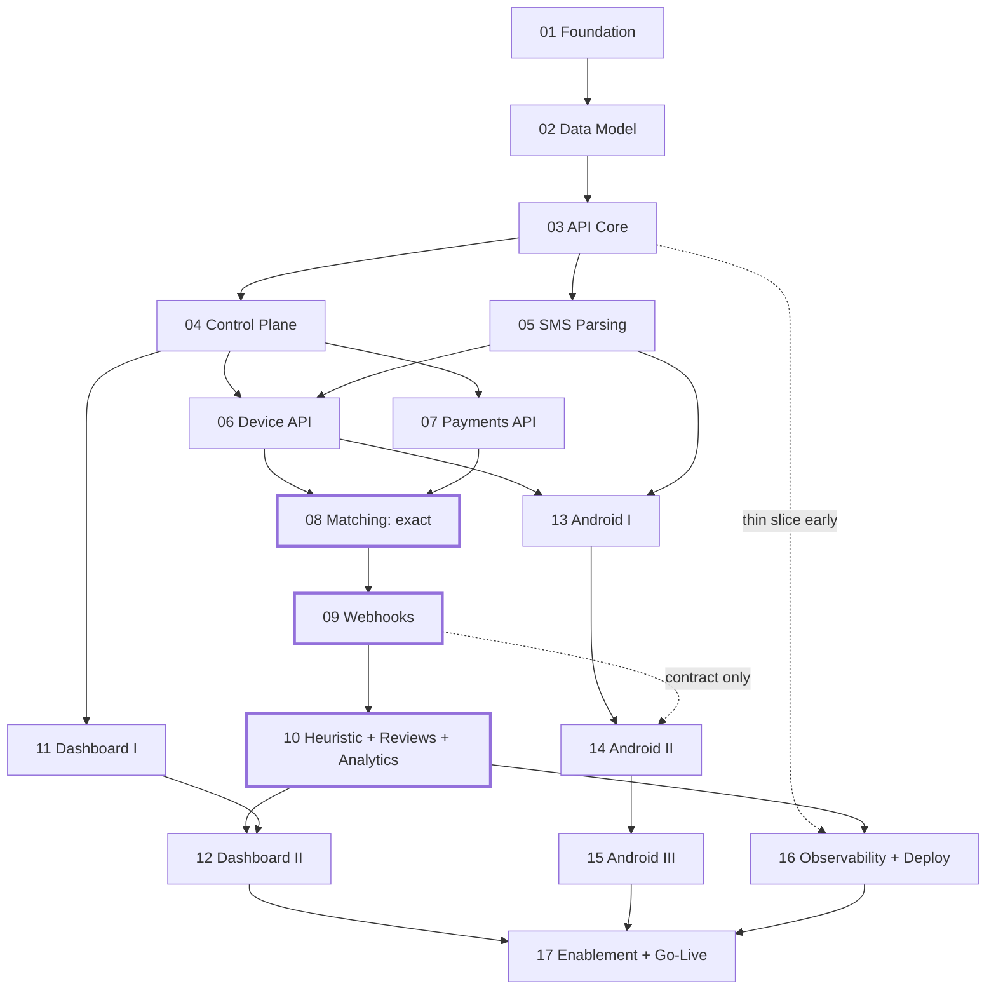

# payment-sync — Implementation Work Plan

Sequential, milestone-based implementation plan derived from [`../architecture.md`](../architecture.md)
and [`../plan.md`](../plan.md).

**17 task files.** The brief suggested 10–15; 17 is the number where each file is one reviewable
milestone with a single acceptance gate. Collapsing further (e.g. one "backend" task) would hide the
money-critical gates — exact matching, webhook delivery, and heuristic matching each need their own
green light before the next thing depends on them. Splitting further (e.g. admin auth apart from
company management) produced files too small to be milestones.

---

## 1. Task index

| # | Task | Track | Depends on | Est. |
|---|---|---|---|---|
| [01](./01-foundation-and-dev-environment.md) | Foundation & Developer Environment | Core | — | 2–3 d |
| [02](./02-data-model-and-migrations.md) | Data Model & Migrations | Core | 01 | 3–4 d |
| [03](./03-api-core-and-auth-primitives.md) | API Core & Auth Primitives | Core | 02 | 4–5 d |
| [04](./04-control-plane.md) | Control Plane: Admin Identity, Companies, Credentials | Core | 03 | 4–5 d |
| [05](./05-sms-parsing-subsystem.md) | SMS Parsing Subsystem | Core | 03 | 4–5 d |
| [06](./06-device-api-and-sms-ingestion.md) | Device API & SMS Ingestion | Core | 04, 05 | 4–5 d |
| [07](./07-client-payments-api.md) | Client Payments API | Core | 04 | 3–4 d |
| [08](./08-matching-engine-exact.md) | Matching Engine — Exact Pass & Invariants | Core | 06, 07 | 4–5 d |
| [09](./09-webhook-delivery.md) | Webhook Delivery Subsystem | Core | 08 | 4–5 d |
| [10](./10-heuristic-matching-reviews-analytics.md) | Heuristic Matching, Review Queue & Analytics API | Core | 09 | 5–6 d |
| [11](./11-admin-dashboard-control-plane.md) | Admin Dashboard I — Shell, Auth, Control Plane | Web | 04 (+03) | 4–5 d |
| [12](./12-admin-dashboard-operations.md) | Admin Dashboard II — Operations Screens | Web | 10, 11 | 5–6 d |
| [13](./13-android-foundation-and-capture.md) | Android I — Foundation, Consent, Enrollment, Capture | Android | 05, 06 | 5–7 d |
| [14](./14-android-sync-engine.md) | Android II — Sync Engine, Manual Sync, Diagnostics | Android | 13 (+09) | 5–7 d |
| [15](./15-android-hardening-and-release.md) | Android III — Hardening, Reliability & Release Channel | Android | 14 | 4–6 d |
| [16](./16-observability-deployment-and-backups.md) | Observability, Deployment, CI/CD & Backups | Ops | 03 (thin slice), 10 (full) | 5–6 d |
| [17](./17-client-enablement-and-go-live.md) | Client Enablement, Documentation & Go-Live | Release | 12, 15, 16 | 5–7 d |

**Total ≈ 70–90 working days solo**, materially less with the tracks run in parallel (§3).

---

## 2. Dependency graph

Bold-bordered nodes are the **money-critical gates**: do not start dependent work until their
acceptance criteria are fully green.

---

## 3. Parallelization

Solo, follow the numeric order — it is already a valid topological sort. With help, three tracks run
concurrently once Task 06 lands:

| Track | Tasks | Can start after | Notes |
|---|---|---|---|
| **Core (backend)** | 01→10 | — | Critical path. Everything else waits on its contracts. |
| **Web (dashboard)** | 11→12 | 04 for T11, 10 for T12 | T11 needs only control-plane endpoints; build against generated OpenAPI client. |
| **Android** | 13→15 | 06 | T13/T14 develop against a **mock server generated from `docs/openapi.yaml`** plus the local dev stack. Only T14's webhook-visibility assertions need T09 deployed. |
| **Ops** | 16 | 03 (thin slice) | See pull-forward note below. |

**Pull-forward (strongly recommended):** implement the *thin slice* of Task 16 — production
`docker-compose.yml`, Caddy, GitHub Actions build+deploy, staging environment — immediately after
Task 03. Deploying an almost-empty API to staging on day 10 costs a day and removes the classic
"everything works locally, nothing works on the VPS" week at the end. The rest of Task 16 (metrics,
alerts, backups, invariant job) stays in phase order because it needs real signals to alert on.

---

## 4. Global conventions

**Branching / PRs**
- One branch per task: `task/NN-slug` (e.g. `task/08-matching-engine-exact`).
- Sub-branches for large tasks: `task/NN-slug--subtopic`, squashed into the task branch.
- PR title: `Task NN — <title>`; PR body pastes the task's acceptance criteria as a checklist.
- Conventional commits (`feat:`, `fix:`, `chore:`, `test:`, `docs:`, `refactor:`).

**Migrations**
- `pnpm --filter api prisma migrate dev --name <verb_object>` (snake_case, e.g. `add_match_attempts`).
- Expand → migrate → contract. **Never** a destructive change in one release on a money table.
- Every migration reviewed as SQL, not just as a schema diff.

**Money & time (non-negotiable, enforced in review)**
- Money is `NUMERIC(14,2)` in Postgres, integer paisa in comparisons, decimal **strings** on the
  wire. No `number` arithmetic on amounts anywhere, ever.
- Timestamps are `timestamptz` UTC in storage, ISO-8601 with offset on the wire, `Asia/Dhaka` only
  at presentation. Containers run `TZ=UTC`.

**Definition of Done — applies to every task in addition to its own criteria**
1. `pnpm lint && pnpm typecheck && pnpm test` green (plus `./gradlew lint test` for Android tasks).
2. New behaviour has tests at the right level; money-path behaviour has a failing-first test.
3. `docs/openapi.yaml` regenerated and CI's breaking-change check passes (backend tasks).
4. Docs updated: `architecture.md` if a decision changed, `docs/runbook.md` if ops behaviour changed,
   `.env.example` if config changed.
5. No `TODO`/`FIXME`/`any`/silent `catch` on the money path (ingest → parse → match → webhook).
6. Secrets never logged; new log lines checked against the redaction list.
7. The task's own "smoke demo" (each file names one) performed and recorded in the PR.

**Test layers**
| Layer | Tool | Where |
|---|---|---|
| Unit | Vitest | pure logic: parsers, scoring, money, signing |
| Integration | Vitest + Testcontainers (PG 16 + Redis 7) | repositories, matching transactions, queues |
| E2E API | Vitest + supertest + local webhook receiver | full journeys per `architecture.md §5` |
| Contract | OpenAPI lint + `oasdiff` breaking check + reference webhook verifiers | CI |
| Android unit | JUnit5 + Turbine | parser parity, state machine |
| Android instrumented | AndroidX Test + WorkManager TestDriver + MockWebServer | capture, sync, Room migrations |
| Load | k6 | Task 17 |

---

## 5. Progress tracker

Update the status column in this table as part of each task's PR.

| # | Task | Status | PR | Notes |
|---|---|---|---|---|
| 01 | Foundation & Dev Environment | ☑ Done | task/01-foundation-and-dev-environment | monorepo, shared primitives (money/hmac/time/ids), config, parsers shell, infra dev compose, CI, hooks |
| 02 | Data Model & Migrations | ☑ Done | main | Prisma schema (all §6 tables + match_attempts), invariant SQL migration, seed, embedded-postgres test harness, 123 tests incl. failing-insert constraint proofs |
| 03 | API Core & Auth Primitives | ☑ Done | main | NestJS bootstrap, zod config + AES-GCM crypto, pino logging + request ctx, error envelope, 3-audience default-deny guard, tenant-scoped Prisma, Redis rate limit, idempotency, health/metrics, OpenAPI; 17 e2e + 140 tests |
| 04 | Control Plane | ☑ Done | main | admin login+TOTP+recovery codes, session rotation w/ reuse detection, companies + dual-key issuance/rotation + webhook-secret rotation, settings bounds, device admin + directives, audit w/ redaction; 9 e2e (150 tests) |
| 05 | SMS Parsing Subsystem | ☑ Done | main | data-driven rules + normalizers + pure reference parser; bKash Cash In & Send Money as exact fixtures (debits IGNORED); server ParserService + RuleRepository (redis-invalidated) + reparse/health admin; 180 tests |
| 06 | Device API & SMS Ingestion | ☑ Done | main | device register/heartbeat+directives/config(ETag)/token-rotate/events; sms/upload batch pipeline: dedupe (client+content+batch), server parse, matching-hook stub; 8 e2e (188 tests) |
| 07 | Client Payments API | ☑ Done | main | POST/GET/list/cancel payments, register (EXACT/HEURISTIC, idempotent, dup order/TrxID → 409, rate-limited); ADR-14 PATCH transaction-id correction (PENDING/expired-in-grace, re-match hook); SSRF SafeUrl guard; expiry sweep; webhook-test shell; 18 e2e (206 tests) |
| 08 | Matching Engine — Exact | ☑ Done | main | pure decision core (guards→future→exact→heuristic port) + property tests; transactional runner w/ per-company advisory lock, FOR UPDATE candidates, conflict reconcile; forward + reverse (register/correction) hooks wired real; late-match in grace, duplicate-TrxID→review, decision trace per attempt; rescan (redis-deduped) + invariant job + void endpoint; 36 new tests (242 total) |
| 09 | Webhook Delivery | ☑ Done | main | frozen payload_raw + shared-HMAC signer (fresh t/attempt, v0 rotation); delivery worker (classify, persisted retry schedule 30s→24h+jitter, 4xx early-stop, 410 cancel, no-redirect, timeout, send-time SSRF re-validate); per-company breaker; orphan sweeper; expiry emits payment.expired; synchronous /webhooks/test; admin retry/replay-dead/endpoint-health; PHP/JS/Py reference verifiers (JS CI-executed); +Redis keyPrefix test isolation. 30 new tests (273 total). Deferred to T16: BullMQ scheduling, docker-CI PHP/Py exec, low-level IP-pin |
| 10 | Heuristic Matching & Reviews | ☑ Done | main | pure amount+sender+time+provider scoring (collision counts only sender-compatible rivals) + threshold/0.25-gap rules; candidate query (transaction_id IS NULL load-bearing, window, cap→REVIEW); reverse heuristic at register; adversarial suite (zero false verifies) + review resolve (link MANUAL_ADMIN / dismiss, idempotent, state-revalidated) + payment.review_required; 7 analytics endpoints (Dhaka-day, 60s cache, as_of) reconciled; 27 new tests (300 total) |
| 11 | Admin Dashboard I | ☑ Done | main | Next.js 15 App Router admin (builds, 12 routes); in-memory access token + httpOnly-cookie single-flight refresh + idle timeout + CSP; login/TOTP-enrol(QR+recovery)/verify; companies list/create→one-time reveal+packet/detail w/ typed-confirm status actions + webhook-test; devices list/detail (online dot, force-sync/block/retire/rotate); audit + sessions; offline-devices banner; UI kit; 10 admin unit tests (format/refresh single-flight/errors). Deferred (needs running API+browser): Playwright e2e + axe |
| 12 | Admin Dashboard II | ☑ Done | main | ops screens (admin builds, 21 routes): overview alert strip + KPIs; transactions (4 tabs + search) & the decision-trace drill-down (raw SMS / extraction / match_attempts with plain-language guards + scored candidates); review queue (link MANUAL_ADMIN / dismiss); webhooks list+attempt history+retry; parser health; analytics (self-contained SVG chart + CSV). Backend addendum: admin/ops sms-logs & orders list/drill-down read models (4 tests, 315 total) |
| 13 | Android I | ☑ Done | main | Kotlin/Compose app — **build-verified** (`./gradlew testDebugUnitTest assembleDebug` green on JDK 21 + SDK 35, 13 unit tests, app-debug.apk). ParserEngine provably equal to server (ParserParityTest over exported fixtures = release gate); Money=Long paisa; AddressAllowlist (exact, fails-closed, spoof-proof); MessageHash golden vector; SmsReceiver→CaptureSms→Room (idempotent hash); EncryptedSharedPreferences store (enroll key never persisted); Retrofit+ApiError; Hilt DI; consent-first onboarding EN+বাংলা. Instrumented tests → emulator CI (android.yml). Parser artifacts exported from packages/parsers (pnpm export:android) |
| 14 | Android II | ☑ Done | main | sync engine — **build-verified** (36 unit tests, app + androidTest APKs). Pure state machine (exhaustive state×event; DUPLICATE=success, 401→NEEDS_REENROLL keeps rows, FAILED still recoverable) + backoff + settlement (mixed batch by hash, unknown-hash tolerant) + directives + diagnostics formatter (safe-by-construction). One unique queue drainer (≤50 oldest-first); Manual Sync w/ truthful summary; Reconcile 6h + stale-claim reclaim; Heartbeat 15m + directives + token rotate; Purge (never unsent); BootReceiver. Dashboard/Transactions/Diagnostics on real data + notifier. Instrumented queue tests compile → emulator CI |
| 15 | Android III | ◐ Code done, field validation pending | main | hardening — **build-verified incl. minified release APK** (55 unit tests; R8 caught+fixed 2 real missing-class failures). Cert pinning (intermediate+backup, release-only, interception message) + network-security-config (no cleartext, no user CAs) + data-extraction rules; R8/shrink + keep rules; signing from CI env (fails loudly, never debug-key fallback); OEM autostart deep links (crash-safe fallback) + battery-opt + ReliabilityScore; optional foreground service; update channel (latest.json, min-version block, SHA-256 verify-before-install); revoke&wipe; privacy policy + EN/BN strings; android-release.yml. **Pending (needs hardware/people): device-matrix execution, MITM pin test, real pin values, Bengali review, battery measurement** |
| 16 | Observability & Deployment | ☐ Not started | | |
| 17 | Enablement & Go-Live | ☐ Not started | | |

Legend: ☐ Not started · ◐ In progress · ☑ Done · ⚠ Blocked

---

## 6. Cross-cutting risk register

| Risk | Owner task | Mitigation | Contingency |
|---|---|---|---|
| **No real SMS corpus** — parser rules are provisional (`architecture.md §20.2`) | 05 | Rules are versioned data + fixture-gated; re-parse tooling from day one | Pilot with one merchant, bump rule versions, bulk re-parse; unparsed messages are stored, never lost |
| **OEM battery killers** silently stop capture | 14, 15 | Reconcile scan + Manual Sync + heartbeat offline alerting means correctness never depends on the broadcast | Foreground-service mode; document per-OEM autostart steps |
| **Google Play blocks the SMS app** (`architecture.md §17.1`) | 15 | Direct signed-APK channel is the primary plan | Notification-listener capture adapter behind the same interface |
| **False verification** (money loss for a client) | 08, 10 | DB-level double-UNIQUE invariants; review queue over guessing; adversarial fixture suite | Manual verify + audit trail; per-tenant `heuristic_enabled=false` kill switch |
| **Client webhook endpoint unreliable** | 09 | 8-attempt backoff, DLQ, circuit breaker, poll-fallback endpoint | Bulk replay from dashboard |
| **Scope creep from post-v1 list** | all | `plan.md §16` items are explicitly out of scope in every task file | Roadmap in `architecture.md §19` |

---

## 7. Secrets & config checklist (must exist before Task 16's staging deploy)

`DATABASE_URL` · `REDIS_URL` · `KEY_ENCRYPTION_KEY` (32-byte base64) · `JWT_ACCESS_SECRET` ·
`JWT_REFRESH_SECRET` · `ADMIN_ORIGIN` · `ADMIN_IP_ALLOWLIST` (optional) · `PUBLIC_API_URL` ·
`WEBHOOK_USER_AGENT` · `SENTRY_DSN` · `ALERT_EMAIL` + SMTP creds · `TELEGRAM_BOT_TOKEN` +
`TELEGRAM_CHAT_ID` · `BACKUP_S3_ENDPOINT/BUCKET/KEY/SECRET` · `BACKUP_ENCRYPTION_KEY` ·
`ANDROID_KEYSTORE_BASE64` + `ANDROID_KEYSTORE_PASSWORD` + `ANDROID_KEY_ALIAS/PASSWORD` ·
`LOG_LEVEL` · `TZ=UTC`.

All documented in `infra/.env.example`; none committed.
